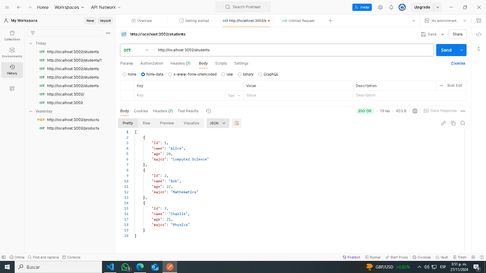
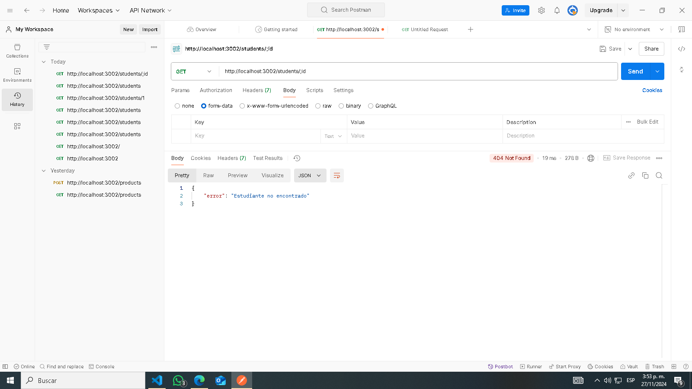
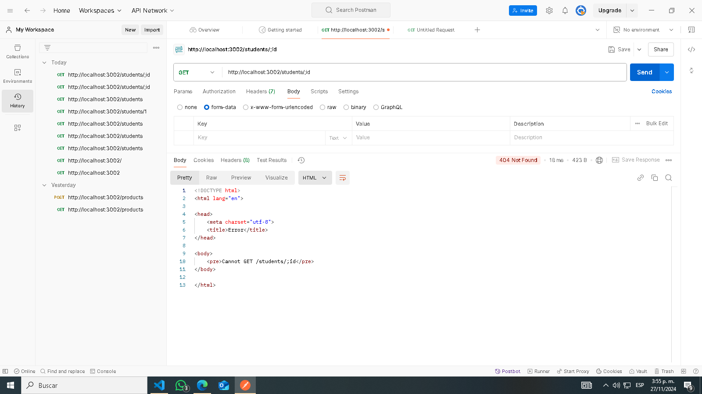

# Students API

## Descripción

API básica para gestionar estudiantes. Implementada con Node.js y Express.

## Endpoints

### GET /students

- Retorna una lista de todos los estudiantes.

### GET /students/:id

- Retorna un estudiante específico basado en su ID.

### DELETE /students/:id

- Elimina un estudiante basado en su ID.

## Cómo ejecutar el proyecto

1. Clona este repositorio.
2. Instala las dependencias:
3. bash

npm install
